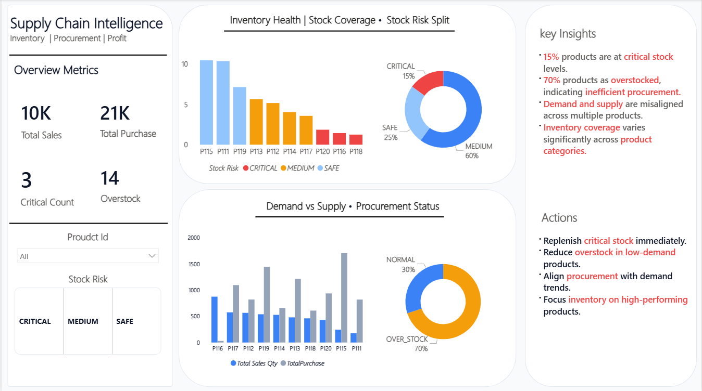
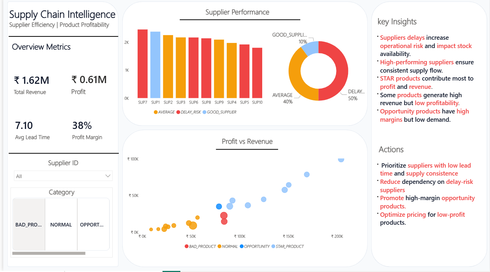

# Supply Chain Intelligence Dashboard

## Project Overview

This project presents a 2-page Supply Chain Intelligence Dashboard built using SQL and Power BI.

It focuses on analyzing:

* Inventory health and stock risks
* Demand vs supply mismatch
* Supplier performance and lead time efficiency
* Product profitability using revenue vs profit analysis

The dashboard is designed for both **operational monitoring** and **strategic decision-making**.

## Business Problem

Organizations often struggle with:

* Overstock and stockouts
* Poor demand forecasting
* Supplier delays impacting inventory
* Low profitability despite high sales

This dashboard helps identify and solve these issues using data-driven insights.

## Approach

* Performed data analysis using SQL
* Created KPIs and measures using DAX in Power BI
* Built a 2-page dashboard:

  * **Page 1:** Inventory & Procurement Analysis
  * **Page 2:** Supplier & Profitability Analysis
* Added business insights and actionable recommendations

## Dashboard Features

### Page 1: Inventory & Procurement

* Inventory health using Days Remaining
* Stock risk classification (Critical, Medium, Safe)
* Demand vs Supply comparison
* Overstock and shortage identification
  
### Page 2: Supplier & Profitability

* Supplier performance analysis using lead time and supply
* Profit vs Revenue analysis using scatter plot
* Product categorization (Star, Bad, Opportunity, Normal)

## Key Insights

* ~15% products are at critical stock levels
* Majority of products show overstock patterns
* Supplier delays impact inventory availability
* Some products generate high revenue but low profitability
* Opportunity products have high margins but low demand

## Business Impact

* Helps reduce overstock and improve working capital efficiency
* Identifies critical stock risks for better inventory planning
* Enables better supplier selection using lead time analysis
* Improves profitability by identifying high-margin products

## Business Recommendations

* Optimize procurement planning based on demand trends
* Reduce overstock inventory to free working capital
* Prioritize suppliers with lower lead time
* Improve pricing strategy for low-profit products
* Focus marketing on high-margin opportunity products

## Tools Used

* SQL (Data Analysis)
* Power BI (Dashboard & Visualization)
* Excel (Data Preparation)

## Dashboard Preview

### Inventory & Procurement Dashboard

### Supplier & Profitability Dashboard

## Files Included

* SQL queries for data analysis
* Raw datasets (CSV files)
* Power BI dashboard (.pbix file)

## Author

**Paras Grover**
Aspiring Data Analyst | SQL | Power BI | Excel

